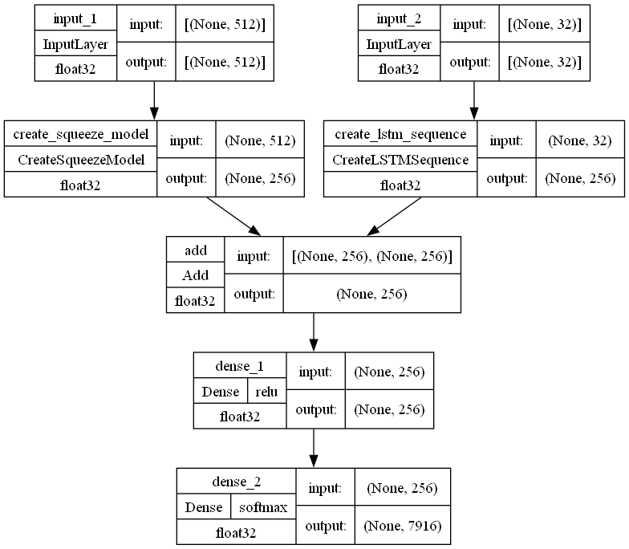
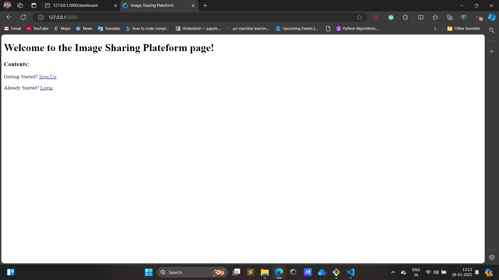
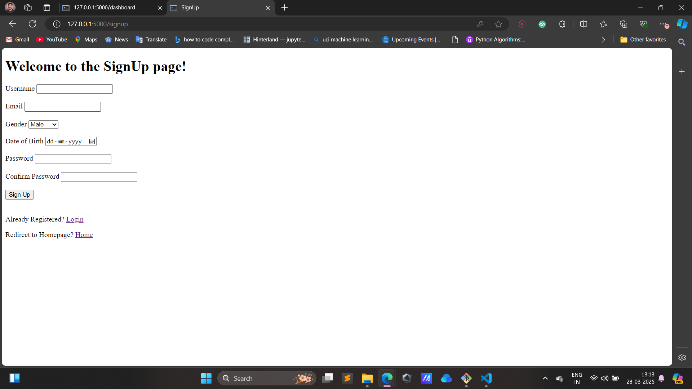
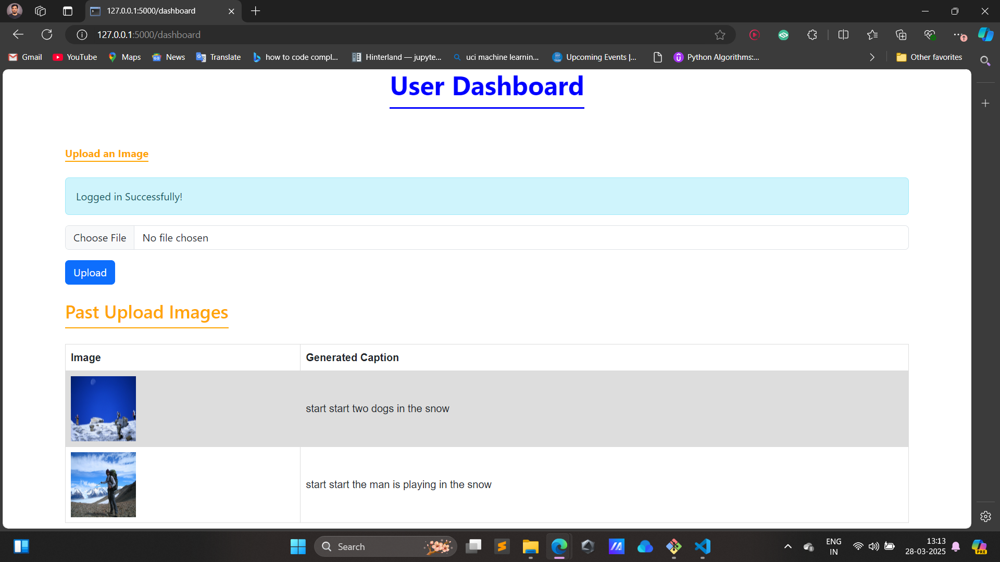

## Image Sharing Plateform Project:
  []
  []
  
  
  []
  []
  []

- Simple image sharing plateform project which basically utilizes concept of Image Captioning.

## 🔥 Key Features
- User can signup by providing required data.
- Login using gmail and password
- All data in stored in mongodb
- User will login and upload a picture of his choice and caption for uploaded image can be created automatically.

## Overview:

This repository contains code for an image caption generation system using deep learning techniques. The system leverages a pretrained VGG16 model for feature extraction and a custom captioning model which was trained using LSTM for generating captions. The model is trained on the Flickr8k dataset using an lstm to generate caption.

## Model Architecture:


## Project demo:
home page:



signup page:



login page:


user dashboard:



## 📚 How It Works

1. Image Processing with CNNs: The CNN component of the model processes the input images, extracting high-level features that represent the visual content.
2. Caption Generation with LSTMs: These features are then passed to the LSTM network, which generates a natural language description of the image.
3. End-to-End Learning: The model is trained end-to-end, ensuring that the captions generated are closely aligned with the visual content.

## 📸 About the Dataset

The [Flickr8k dataset](https://www.kaggle.com/adityajn105/flickr8k) is used for training and evaluating the image captioning system. It consists of 8,091 images, each with five captions describing the content of the image. The dataset provides a diverse set of images with multiple captions per image, making it suitable for training caption generation models.

Download the dataset from [Kaggle](https://www.kaggle.com/adityajn105/flickr8k) and organize the files as follows:

- flickr8k
  - Images
    - (image files)
  - captions.txt

## 🎉 Why This Project?

The Image Caption Generator is an exciting demonstration of how AI can bridge the gap between visual understanding and language generation. It's a perfect project for anyone interested in deep learning, computer vision, or natural language processing.

## 🚀 Future Enhancements:

1. **Fine-tuning**: Experiment with fine-tuning the captioning model architecture and hyperparameters for improved performance.

2. **Dataset Expansion:** : Incorporate additional datasets to increase the diversity and complexity of the trained model for example we can train the model on [Flickr30k dataset](https://www.kaggle.com/datasets/hsankesara/flickr-image-dataset).

3. **Beam Search:** Implement beam search decoding for generating multiple captions and selecting the best one.

4. **Multilingual Captioning:** Extend the model to generate captions in multiple languages by incorporating multilingual datasets.


### 📦Getting Started:

Clone this repository:
```
 git clone https://github.com/mishraatharva/Image_Sharing_Platform.git
```